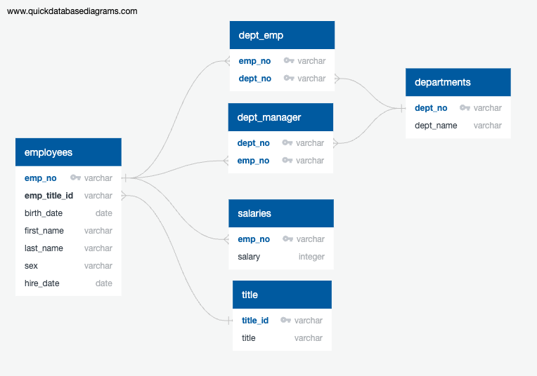
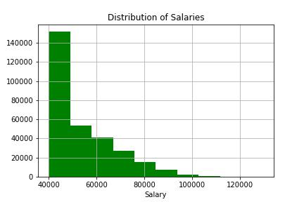
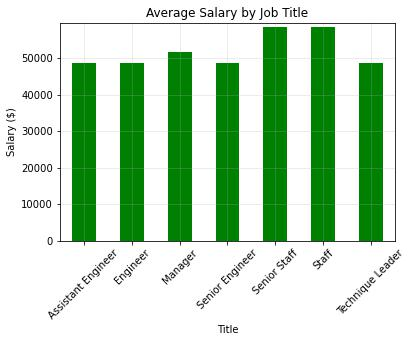

## Homework 9 for UMN Data Boot Camp - SQL

### Overview
The purpose of this exercise was to use our skills with SQL to create an employee database in PostgreSQL, run a selection of queries, and analyze the data in a Jupyter Notebook. The `data` directory contains the source data provided in the exercise.

### Database Schema
Below is the schema I created in Quick Database Diagrams for the employee database. The SQL code created is in [schema.sql](schema.sql)

### Queries

The exercise required us to write SQL queries to retrieve data from our database. [Queries.sql](queries.sql) is the file that contains my queries, with comments referring to the instructions.

### Analysis
I used SQLAlchemy to connect to my PostgreSQL database in a Jupyter Notebook in order to perform some basic analyses. I made a histogram of employee salaries using a basic query of the salaries table.
 

I also made a bar chart of average salaries by job title. I queried the necessary tables into dataframes and performed the rest of the analysis using Python/Pandas. I joined the dataframes together and then calculated the average salary for each job title. Finally I graphed the results with Matplotlib:

